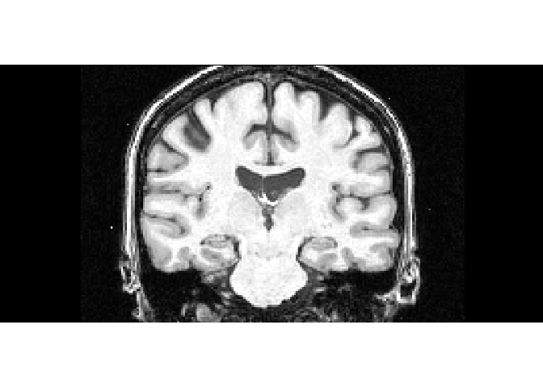

Brain MRI Segmentation
================
MA
May 2, 2018

This project attempts to show how to use R and different machine leanring algorithms to classify Brain MRI.

First, let us take a look at the original MRI.

``` r
library(grid)
library(png)
Original.MRI=readPNG("C:/Users/mym/Documents/Git-R/Brain MRI/Classify-Brain-MRI-by-Machine-Learning-in-R/110_2_orig.png")
grid.raster(Original.MRI)
```



And take a look at the associated segmented MRI:

``` r
Segmented.MRI=readPNG("C:/Users/mym/Documents/Git-R/Brain MRI/Classify-Brain-MRI-by-Machine-Learning-in-R/110_2_seg.png")
grid.raster(Segmented.MRI)
```


