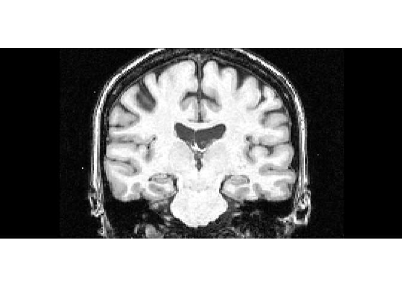
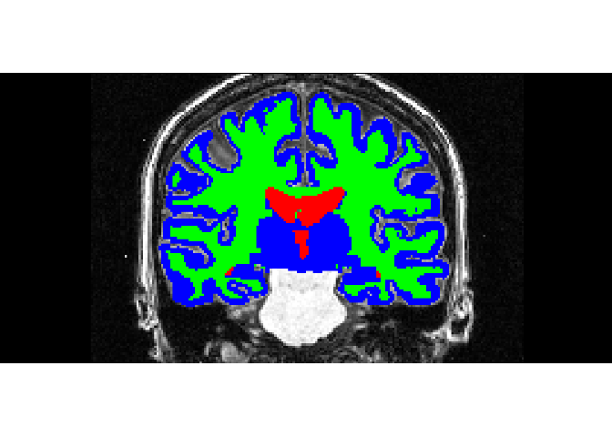
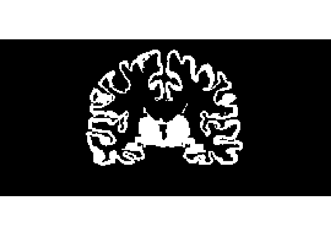

Brain MRI Segmentation
================
MA
May 2, 2018

This project attempts to show how to use R and different machine leanring algorithms to classify Brain MRI.

First, let us take a look at the original MRI.

``` r
library(grid)
library(png)
Original.MRI=readPNG("C:/Users/mym/Documents/Git-R/Brain MRI/Classify-Brain-MRI-by-Machine-Learning-in-R/110_2_orig.png")
grid.raster(Original.MRI)
```



And take a look at the associated segmented MRI:

``` r
Segmented.MRI=readPNG("C:/Users/mym/Documents/Git-R/Brain MRI/Classify-Brain-MRI-by-Machine-Learning-in-R/110_2_seg.png")
grid.raster(Segmented.MRI)
```



Our task is to segment from the original MRI grey matter, white matter and csf as showed in blue, green and red in the segmented MRI.

Before we go any further, we need to know how the MRI stored in computer in terms of data. Namely, what the Original.MRI look like? In fact, Original.MRI is an array with 3 dimensions, or we can say it consists of 3 layers of indicating Red, green and blue respectively and each layer is a 2 dinension matrix indicating the location of each pixel. In general, the value in the array is between 0 and 1 or 0 and 255.

In order to understand the structure of MRI data, let take advantage of segmented MRI to display grey matter, white matter and csf from the original MRI respectively.

``` r
Segmented.MRI.Integer=Segmented.MRI*255 #original value is between 0 and 1. This converts them into integers
#copy the original MRI 3 times
Original.MRI.white.matter=Original.MRI
Original.MRI.grey.matter=Original.MRI
Original.MRI.csf=Original.MRI
#use the segmented MRI to display those three matters respectively from the original MRI.
for (i in (1:dim(Original.MRI)[1])){
  for (j in (1:dim(Original.MRI)[2])){
    Original.MRI.white.matter[i,j,]=ifelse(all(Segmented.MRI.Integer[i,j,1:3]==c(0,255,0)),c(1,1,1),c(0,0,0))
    Original.MRI.grey.matter[i,j,]=ifelse(all(Segmented.MRI.Integer[i,j,1:3]==c(0,0,255)),c(1,1,1),c(0,0,0))
    Original.MRI.csf[i,j,]=ifelse(all(Segmented.MRI.Integer[i,j,1:3]==c(255,0,0)),c(1,1,1),c(0,0,0))
  }
}
#display white matter from the original MRI
grid.raster(Original.MRI.white.matter)
```


``` r
#display grey matter from the original MRI
grid.raster(Original.MRI.grey.matter)
```



``` r
#display csf from the original MRI
grid.raster(Original.MRI.csf)
```


Now get the data to be classified ready.

``` r
n =sum(as.numeric(Original.MRI.white.matter[,,1])+as.numeric(Original.MRI.grey.matter[,,1])+as.numeric(Original.MRI.csf[,,1])) #total pixels to be classified
index = 1
mydata=matrix(nrow=n,ncol=25)
for (i in (1:dim(Original.MRI)[1])){
  for (j in (1:dim(Original.MRI)[2])){
    if (!!Original.MRI.white.matter[i,j,1] || !!Original.MRI.grey.matter[i,j,1] || !!Original.MRI.csf[i,j,1]){
      if (index==1){
        print(i)
        print(j)
      }
      mydata[index,]=as.vector(Original.MRI[(i-2):(i+2),(j-2):(j+2),1])
      index=index+1
    }
  }
}
```

    ## [1] 58
    ## [1] 876

Visualize the first block

``` r
MRI.vis.1=Original.MRI
MRI.vis.1[(58-2):(58+2),(876-2):(876+2),1]*255
```

    ##      [,1] [,2] [,3] [,4] [,5]
    ## [1,]   34   34   29   29   29
    ## [2,]   34   34   29   29   29
    ## [3,]  108  108  139  139  139
    ## [4,]  108  108  139  139  139
    ## [5,]  108  108  139  139  139

``` r
MRI.vis.1[(58-2):(58+2),(876-2):(876+2),]=c(1,1,1)
grid.raster(MRI.vis.1)
```


